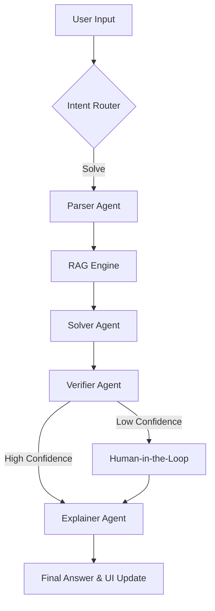

# 🧠 Math Mentor AI

**Math Mentor AI** is a state-of-the-art, multi-agent AI system specifically designed for solving **JEE-level math problems**. By combining advanced Vision-Language Models (VLM), Audio Transcription (Whisper), and a structured Agentic Orchestration flow, it provides accurate, verified, and detailed step-by-step solutions to complex mathematical queries.

## 🚀 Live Demo
*   **Modern Web UI (Vercel):** [https://math-mentor-ai-alpha.vercel.app/](https://math-mentor-ai-alpha.vercel.app/)
*   **Gradio UI (Hugging Face):** [Agent-Omkar/math-mentor-ai](https://huggingface.co/spaces/Agent-Omkar/math-mentor-ai)
*   **FastAPI Backend:** [Agent-Omkar/math-mentor-backend](https://huggingface.co/spaces/Agent-Omkar/math-mentor-backend)

---

## 🌟 Key Features

### 1. 📝 Multi-Modal Multi-Input Support
Users can interact with the mentor in several ways:
*   **Text Query**: Type directly into the rich text area.
*   **📷 Image Extraction (VLM)**: Upload a photo of a math problem. The system extracts math text using Vision models with integrated review steps for low-confidence scans.
*   **🎤 Audio Transcription**: Record your problem statement. Integrated Whisper Large Turbo model provides high-accuracy transcription with JEE-specific term cleaning.

### 2. ⚛️ Advanced Math Rendering
*   **LaTeX Support**: Full support for KaTeX/LaTeX in bot responses (equations, fractions, integrals).
*   **Live LaTeX Preview**: As you type `$math$`, the UI provides a real-time rendered preview below the input bar so you can see your equation before sending.

### 3. 🚉 Agentic Orchestration Flow
The system doesn't just guess; it follows a rigorous multi-step pipeline:

### 4. 🧠 The Agent Team
*   **Parser Agent**: Cleans the input and identifies the specific math topic (Calculus, Algebra, etc.).
*   **RAG Engine**: Retrieves relevant formulas and solved examples from the internal JEE knowledge base (ChromaDB).
*   **Solver Agent**: Generates the step-by-step solution, utilizing specialized tools if necessary.
*   **Verifier Agent**: Critically evaluates the solution for logical errors or calculation slips.
*   **Explainer Agent**: Polishes the final response for pedagogical clarity and math-mentor style.

### 5. ⏳ Pro UI Features
*   **Sticky Input Area**: A modern, fixed input bar at the bottom with integrated file attachment.
*   **History Sidebar**: Quick access to your last 10 conversations with compact formatting.
*   **Live Orchestration Stats**: View which agent is currently working in the right-hand Inspector tab.

---

## 🛠️ Technology Stack
*   **Frontend**: Gradio (4.44.1), Custom CSS/JS.
*   **Backend**: FastAPI, Uvicorn (Standard).
*   **LLMs**: Groq (Llama-3.1-70B for reasoning, Whisper-Large-V3 for audio).
*   **Embeddings**: Google Gemini (`models/gemini-embedding-001`).
*   **Vector DB**: ChromaDB for local knowledge persistence.

---

## ⚙️ How to Run Locally

### Backend
1.  Navigate to `backend/`.
2.  Install dependencies: `pip install -r requirements.txt`.
3.  Set up `.env` with `GROQ_API_KEY` and `GOOGLE_API_KEY`.
4.  Run server: `uvicorn main:app --reload`.

### Frontend
1.  Navigate to `gradio_frontend/`.
2.  Install dependencies: `pip install -r requirements.txt`.
3.  Run UI: `python app.py`.

---

## ☁️ Deployment Configuration
This project is configured for **Hugging Face Spaces**:
*   **Backend**: Deployed as a **Docker** space for persistent local dependency management.
*   **Frontend**: Deployed as a **Gradio** space, communicating with the backend via the `BACKEND_URL` secret.

---

*Developed with ❤️ for math students everywhere.*
